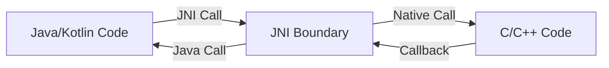

The Java Native Interface (JNI) is the bridge that allows Java and Kotlin code to call and be called by native C/C++ code. It's the fundamental mechanism that enables NDK development on Android.

## What is JNI?

JNI is a standardized API that provides:

- **Two-way communication**: Java/Kotlin can call C/C++ functions, and C/C++ can call back into Java/Kotlin
- **Type system mapping**: Conversions between Java types and C types
- **Object access**: Native code can create, inspect, and modify Java objects
- **Exception handling**: Propagate and handle exceptions across the language boundary
- **Memory management**: Coordinate between garbage-collected Java heap and manually-managed native memory

<Info>
  JNI is a standard Java feature, not Android-specific. However, Android makes heavy use of JNI for its native components.
</Info>

## How JNI works

### Basic architecture



The JNI layer handles:

1. **Function dispatch**: Routing Java native method calls to C/C++ implementations
2. **Type marshaling**: Converting data between Java and C representations
3. **Reference management**: Tracking object references across the boundary
4. **Thread synchronization**: Ensuring thread-safe access to JVM state

### Native method declaration

In Java/Kotlin, declare methods with the `native` keyword:

<Tabs>
  <Tab title="Kotlin">
    ```kotlin
    class NativeLib {
        // Simple native method
        external fun computeHash(input: String): Long
        
        // Native method with primitives
        external fun processArray(data: IntArray): IntArray
        
        // Static native method
        companion object {
            external fun initialize()
            
            init {
                System.loadLibrary("native-lib")
            }
        }
    }
    ```
  </Tab>
  
  <Tab title="Java">
    ```java
    public class NativeLib {
        // Simple native method
        public native long computeHash(String input);
        
        // Native method with primitives
        public native int[] processArray(int[] data);
        
        // Static native method
        public static native void initialize();
        
        static {
            System.loadLibrary("native-lib");
        }
    }
    ```
  </Tab>
</Tabs>

### Native implementation

C/C++ implementations follow a naming convention:

```c
#include <jni.h>
#include <string.h>

// Function name format: Java_<package>_<class>_<method>
JNIEXPORT jlong JNICALL
Java_com_example_NativeLib_computeHash(JNIEnv* env, jobject thiz, jstring input) {
    // Get UTF-8 string from Java string
    const char* str = (*env)->GetStringUTFChars(env, input, NULL);
    if (str == NULL) {
        return 0; // Out of memory
    }
    
    // Compute hash (simple example)
    jlong hash = 0;
    for (int i = 0; str[i] != '\0'; i++) {
        hash = hash * 31 + str[i];
    }
    
    // Release the string
    (*env)->ReleaseStringUTFChars(env, input, str);
    
    return hash;
}
```

<Note>
  C++ can use a cleaner syntax with the `-&gt;` operator instead of `(*env)-&gt;`. C++ also allows automatic JNI method registration.
</Note>

## JNI types and signatures

### Type mappings

Java types map to corresponding C types:

| Java Type | Native Type | Signature |
|-----------|-------------|----------|
| boolean | jboolean | Z |
| byte | jbyte | B |
| char | jchar | C |
| short | jshort | S |
| int | jint | I |
| long | jlong | J |
| float | jfloat | F |
| double | jdouble | D |
| void | void | V |
| Object | jobject | Ljava/lang/Object; |
| String | jstring | Ljava/lang/String; |
| Class | jclass | Ljava/lang/Class; |
| Object[] | jobjectArray | [Ljava/lang/Object; |
| int[] | jintArray | [I |
| byte[] | jbyteArray | [B |

### Method signatures

Method signatures encode parameter and return types:

```c
// Java: long method(int n, String s, int[] arr)
// Signature: "(ILjava/lang/String;[I)J"
//            (parameters)return_type

// Find method ID using signature
jmethodID mid = (*env)->GetMethodID(env, clazz, "method", 
                                    "(ILjava/lang/String;[I)J");
```

<Warning>
  Incorrect signatures will cause runtime errors. Use `javap -s` to see the exact signature of Java methods.
</Warning>

## JNIEnv interface

The `JNIEnv*` pointer provides access to all JNI functions:

### Common operations

<AccordionGroup>
  <Accordion title="String operations">
    ```c
    // Java String to C string
    jstring jstr = /* from Java */;
    const char* cstr = (*env)->GetStringUTFChars(env, jstr, NULL);
    // Use cstr...
    (*env)->ReleaseStringUTFChars(env, jstr, cstr);
    
    // C string to Java String
    const char* message = "Hello from native";
    jstring result = (*env)->NewStringUTF(env, message);
    return result;
    
    // For large strings, use direct buffer access
    const jchar* chars = (*env)->GetStringCritical(env, jstr, NULL);
    jsize len = (*env)->GetStringLength(env, jstr);
    // Process chars...
    (*env)->ReleaseStringCritical(env, jstr, chars);
    ```
  </Accordion>
  
  <Accordion title="Array operations">
    ```c
    // Access primitive array
    jintArray arr = /* from Java */;
    jsize len = (*env)->GetArrayLength(env, arr);
    jint* elements = (*env)->GetIntArrayElements(env, arr, NULL);
    
    // Modify elements
    for (int i = 0; i < len; i++) {
        elements[i] *= 2;
    }
    
    // Commit changes back to Java array (0 = copy back and free)
    (*env)->ReleaseIntArrayElements(env, arr, elements, 0);
    
    // Create new array
    jintArray newArr = (*env)->NewIntArray(env, 10);
    jint buffer[10] = {0, 1, 2, 3, 4, 5, 6, 7, 8, 9};
    (*env)->SetIntArrayRegion(env, newArr, 0, 10, buffer);
    ```
  </Accordion>
  
  <Accordion title="Object operations">
    ```c
    // Find class
    jclass stringClass = (*env)->FindClass(env, "java/lang/String");
    
    // Get field ID and access field
    jfieldID fid = (*env)->GetFieldID(env, clazz, "count", "I");
    jint value = (*env)->GetIntField(env, obj, fid);
    (*env)->SetIntField(env, obj, fid, value + 1);
    
    // Call method
    jmethodID mid = (*env)->GetMethodID(env, clazz, "toString", 
                                        "()Ljava/lang/String;");
    jstring result = (*env)->CallObjectMethod(env, obj, mid);
    
    // Create object
    jmethodID constructor = (*env)->GetMethodID(env, clazz, "<init>", "()V");
    jobject newObj = (*env)->NewObject(env, clazz, constructor);
    ```
  </Accordion>
  
  <Accordion title="Exception handling">
    ```c
    // Check for exceptions
    jstring str = (*env)->NewStringUTF(env, "text");
    if ((*env)->ExceptionCheck(env)) {
        (*env)->ExceptionDescribe(env);  // Print to logcat
        (*env)->ExceptionClear(env);
        return NULL;
    }
    
    // Throw exception
    jclass exceptionClass = (*env)->FindClass(env, 
                            "java/lang/IllegalArgumentException");
    (*env)->ThrowNew(env, exceptionClass, "Invalid argument");
    return NULL;  // Must return from native method
    ```
  </Accordion>
</AccordionGroup>

## Reference management

JNI has three types of object references:

### Local references

Automatically managed within native method scope:

```c
JNIEXPORT jobject JNICALL
Java_Example_createObject(JNIEnv* env, jobject thiz) {
    jclass clazz = (*env)->FindClass(env, "java/lang/String");
    // clazz is a local reference, automatically freed when method returns
    
    jstring str = (*env)->NewStringUTF(env, "hello");
    // Can explicitly free to save memory in long methods
    // (*env)->DeleteLocalRef(env, clazz);
    
    return str;  // Return value is caller's responsibility
}
```

<Warning>
  Local references are freed when the native method returns. Do not store them for later use. The JVM has a limit on local references (typically 512).
</Warning>

### Global references

Persist across native method calls:

```c
static jclass gCachedClass = NULL;

JNIEXPORT void JNICALL
Java_Example_initialize(JNIEnv* env, jobject thiz) {
    jclass localClass = (*env)->FindClass(env, "com/example/MyClass");
    // Create global reference to keep class after method returns
    gCachedClass = (*env)->NewGlobalRef(env, localClass);
    (*env)->DeleteLocalRef(env, localClass);
}

JNIEXPORT void JNICALL
Java_Example_cleanup(JNIEnv* env, jobject thiz) {
    if (gCachedClass != NULL) {
        (*env)->DeleteGlobalRef(env, gCachedClass);
        gCachedClass = NULL;
    }
}
```

### Weak global references

Like global references but don't prevent garbage collection:

```c
static jweak gWeakRef = NULL;

JNIEXPORT void JNICALL
Java_Example_setCallback(JNIEnv* env, jobject thiz, jobject callback) {
    if (gWeakRef != NULL) {
        (*env)->DeleteWeakGlobalRef(env, gWeakRef);
    }
    gWeakRef = (*env)->NewWeakGlobalRef(env, callback);
}

JNIEXPORT void JNICALL
Java_Example_invokeCallback(JNIEnv* env, jobject thiz) {
    jobject callback = (*env)->NewLocalRef(env, gWeakRef);
    if (callback != NULL) {
        // Object still alive, use it
        (*env)->DeleteLocalRef(env, callback);
    } else {
        // Object was garbage collected
    }
}
```

## Thread considerations

### JNIEnv is thread-local

Each thread has its own `JNIEnv*`:

<Warning>
  Never cache `JNIEnv*` across threads. Each thread must use its own `JNIEnv*`.
</Warning>

```c
// WRONG - Don't do this!
static JNIEnv* gEnv;  // BAD: JNIEnv is thread-specific

JNIEXPORT void JNICALL
Java_Example_method(JNIEnv* env, jobject thiz) {
    gEnv = env;  // WRONG: Will crash on other threads
}
```

### Attaching native threads

Native threads must attach to access JNI:

```c
#include <pthread.h>

void* thread_func(void* arg) {
    JavaVM* jvm = (JavaVM*)arg;
    JNIEnv* env;
    
    // Attach thread
    (*jvm)->AttachCurrentThread(jvm, &env, NULL);
    
    // Now can use JNI
    jclass clazz = (*env)->FindClass(env, "java/lang/String");
    
    // Detach when done
    (*jvm)->DetachCurrentThread(jvm);
    return NULL;
}

// Cache JavaVM* during JNI_OnLoad
static JavaVM* gJvm = NULL;

JNIEXPORT jint JNICALL
JNI_OnLoad(JavaVM* vm, void* reserved) {
    gJvm = vm;
    return JNI_VERSION_1_6;
}
```

## Performance considerations

### JNI call overhead

Crossing the JNI boundary has cost:

<Tabs>
  <Tab title="Bad: Many small calls">
    ```kotlin
    // Anti-pattern: JNI overhead dominates
    external fun add(a: Int, b: Int): Int
    
    fun sumArray(arr: IntArray): Int {
        var sum = 0
        for (value in arr) {
            sum = add(sum, value)  // JNI call per element!
        }
        return sum
    }
    ```
  </Tab>
  
  <Tab title="Good: Bulk operations">
    ```kotlin
    // Better: Single JNI call
    external fun sumArray(arr: IntArray): Int
    
    fun processData(arr: IntArray): Int {
        return sumArray(arr)  // One JNI call, bulk processing
    }
    ```
  </Tab>
</Tabs>

### Direct buffers

For large data transfer, use direct ByteBuffers:

```java
// Java side
ByteBuffer buffer = ByteBuffer.allocateDirect(1024 * 1024);
nativeProcess(buffer);
```

```c
// Native side - zero-copy access
JNIEXPORT void JNICALL
Java_Example_nativeProcess(JNIEnv* env, jobject thiz, jobject buffer) {
    void* data = (*env)->GetDirectBufferAddress(env, buffer);
    jlong capacity = (*env)->GetDirectBufferCapacity(env, buffer);
    
    // Direct access to buffer memory, no copying
    uint8_t* bytes = (uint8_t*)data;
    for (int i = 0; i < capacity; i++) {
        bytes[i] = process(bytes[i]);
    }
}
```

### Critical sections

For short, performance-critical array access:

```c
jbyte* data = (*env)->GetPrimitiveArrayCritical(env, jarray, NULL);
if (data != NULL) {
    // CRITICAL: No JNI calls allowed here!
    // GC may be disabled, must be very fast
    process_data(data, length);
    (*env)->ReleasePrimitiveArrayCritical(env, jarray, data, 0);
}
```

<Warning>
  Between `GetPrimitiveArrayCritical` and `ReleasePrimitiveArrayCritical`, do not:
  - Call any JNI functions
  - Block or wait
  - Allocate memory
  
  This may disable the garbage collector.
</Warning>

## Best practices

### Check for errors

Always check for NULL and exceptions:

```c
jclass clazz = (*env)->FindClass(env, "com/example/MyClass");
if (clazz == NULL) {
    return NULL;  // Exception already pending
}

jstring str = (*env)->NewStringUTF(env, "text");
if (str == NULL) {
    return NULL;  // Out of memory
}
```

### Use helper macros

Simplify error checking:

```c
#define CHECK_NULL(val) if ((val) == NULL) return NULL
#define CHECK_EXCEPTION(env) if ((*env)->ExceptionCheck(env)) return NULL

JNIEXPORT jstring JNICALL
Java_Example_method(JNIEnv* env, jobject thiz) {
    jclass clazz = (*env)->FindClass(env, "java/lang/String");
    CHECK_NULL(clazz);
    
    jmethodID mid = (*env)->GetMethodID(env, clazz, "<init>", "()V");
    CHECK_NULL(mid);
    
    return (*env)->NewObject(env, clazz, mid);
}
```

### Cache class and method IDs

Lookups are expensive, cache them:

```c
static jclass gStringClass = NULL;
static jmethodID gStringInit = NULL;

JNIEXPORT jint JNICALL
JNI_OnLoad(JavaVM* vm, void* reserved) {
    JNIEnv* env;
    if ((*vm)->GetEnv(vm, (void**)&env, JNI_VERSION_1_6) != JNI_OK) {
        return JNI_ERR;
    }
    
    jclass localClass = (*env)->FindClass(env, "java/lang/String");
    gStringClass = (*env)->NewGlobalRef(env, localClass);
    (*env)->DeleteLocalRef(env, localClass);
    
    gStringInit = (*env)->GetMethodID(env, gStringClass, "<init>", "()V");
    
    return JNI_VERSION_1_6;
}
```

## Next steps

Now that you understand JNI:

- Learn about [ABIs](/concepts/abis) for multi-architecture builds
- Understand [bionic](/concepts/bionic) C library specifics
- Explore [build systems](/build/overview) for compiling native code

<Info>
  For complete JNI reference, see Oracle's [JNI Specification](https://docs.oracle.com/javase/8/docs/technotes/guides/jni/spec/jniTOC.html).
</Info>
